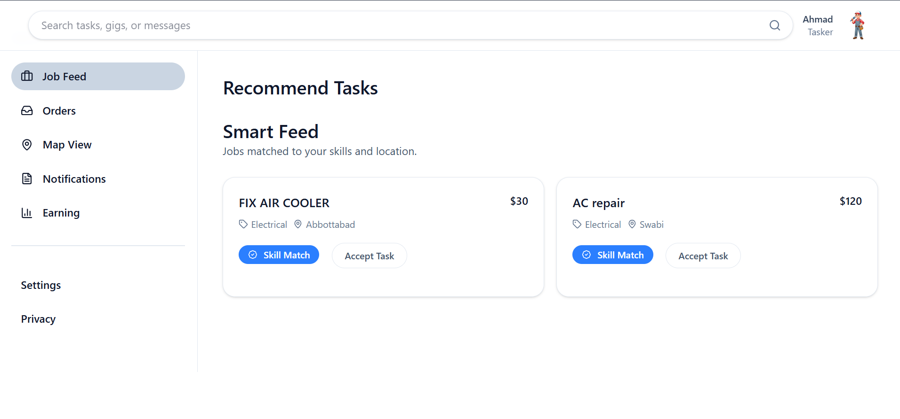

# TaskConnect

TaskConnect is a **MERN-style local services marketplace** that connects customers who need location-aware tasks completed with taskers who can discover, accept, complete, and earn from nearby work. It includes **role-based workflows**, **geospatial matching**, **push notifications**, **payments**, **reviews**, and **admin moderation**.

[](#)
[](#-license)
[](#)

## 📸 Visual Proof

> Add a product screenshot or demo GIF here.

```md

```

## ✨ Features

- **Customer task posting** with budget, urgency, schedule, city, and map coordinates
- **Tasker discovery feed** with search, filters, recommendations, and nearby map matching
- **Role-based authentication** for customers, taskers, and administrators
- **OTP email verification** with hashed, expiring OTP records
- **JWT cookie sessions** with protected frontend and backend routes
- **Task lifecycle management** from open to assigned, in-progress, completed, reviewed, cancelled, and paid
- **Customer reviews** with tasker rating aggregation
- **Stripe payment flow** with platform commission and tasker wallet balance
- **Firebase Cloud Messaging** for task and broadcast notifications
- **Admin dashboard** for KPIs, moderation, finance, analytics, payouts, and marketing blasts
- **Google Maps integration** for task location picking and nearby task visibility
- **Dockerized deployment** for backend API and frontend static app
- **Automated tests** across backend controllers, middleware, utilities, and frontend workflows

## 🧰 Tech Stack

- **Frontend:** React 19.1, Vite 7.0, Tailwind CSS 4.1, React Router 7.5
- **UI & Data:** Framer Motion, Lucide React, Recharts, Axios, React Hot Toast
- **Maps:** Google Maps via `@vis.gl/react-google-maps`, Deck.gl
- **PWA & Push:** Vite PWA, Workbox, Firebase Web SDK
- **Backend:** Node.js 22, Express 5.1, MongoDB 7, Mongoose 8.19
- **Auth & Security:** JWT, bcrypt, HTTP-only cookies, CORS allowlist
- **Payments:** Stripe SDK 20
- **Email:** Brevo, Nodemailer, Resend utilities
- **Testing:** Jest 30, Supertest, Vitest 4, Testing Library, Cypress 15
- **Infrastructure:** Docker, Docker Compose, Nginx, MongoDB Atlas

## 🚀 Getting Started

### Prerequisites

- **Node.js:** 22.x
- **npm:** 10.x or newer
- **Docker:** 27.x or newer
- **Docker Compose:** 2.x or newer
- **MongoDB:** Atlas or compatible MongoDB connection string
- **External service keys:** Stripe, Firebase, Google Maps, Cloudinary, Brevo/email credentials

### Installation

```bash
git clone <repository-url>
cd 03_Source_Code
```

```bash
cd backend
npm install
cp example.env .env
```

```bash
cd ../front-end
npm install
```

Create frontend environment variables:

```bash
cat > .env <<'EOF'
VITE_API_URL=http://localhost:3000
VITE_GOOGLE_MAPS_API_KEY=your-google-maps-api-key
VITE_FIREBASE_API_KEY=your-firebase-api-key
VITE_FIREBASE_VAPID_KEY=your-firebase-vapid-key
VITE_CLOUDINARY_UPLOAD_PRESET=your-cloudinary-upload-preset
EOF
```

Update `backend/.env`:

```env
atlas_URL=your-mongodb-connection-string
JWT_SECRET=your-jwt-secret
EMAIL_USER=your-email-address
EMAIL_PASS=your-email-password
BREVO_API_KEY=your-brevo-api-key
STRIPE_SECRET_KEY=your-stripe-secret-key
STRIPE_WEBHOOK_SECRET=your-stripe-webhook-secret
ADMIN_EMAIL=your-admin-email
ADMIN_PASSWORD=your-bcrypt-hashed-admin-password
ALLOWED_ORIGINS=http://localhost:5173
PORT=3000
```

### Basic Usage

Start the backend API:

```bash
cd backend
npm run dev
```

Start the frontend app in a second terminal:

```bash
cd front-end
npm run dev
```

Open the app:

```text
http://localhost:5173
```

Run tests:

```bash
cd backend
npm test
```

```bash
cd front-end
npm test
```

Run with Docker Compose:

```bash
docker compose up --build
```

## 🧭 Navigation & Governance

- **Contributing:** See [CONTRIBUTING.md](./CONTRIBUTING.md)
- **License:** See [front-end/LICENSE](./front-end/LICENSE)
- **Backend entry point:** [backend/server.js](./backend/server.js)
- **Frontend entry point:** [front-end/src/main.jsx](./front-end/src/main.jsx)
- **Docker Compose:** [docker-compose.yml](./docker-compose.yml)
- **Project documentation:** [SOFTWARE_PROJECT_DOCUMENTATION.md](./SOFTWARE_PROJECT_DOCUMENTATION.md)

## 👤 Author

Maintainer: `Hamza khan `  
Email: `hamzakhan.cs25@example.com`  
GitHub: `@hamzakhan-std25`
